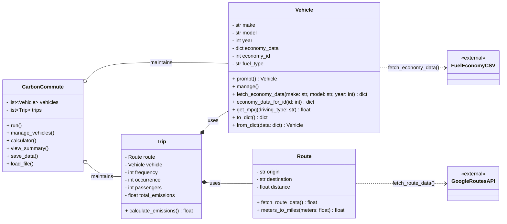

```mermaid
classDiagram
direction LR

    class CarbonCommute {
        - list~Vehicle~ vehicles
        - list~Trip~ trips
        + run()
        + manage_vehicles()
        + calculator()
        + view_summary()
        + save_data()
        + load_file()
    }

    class Trip {
        - Route route
        - Vehicle vehicle
        - int frequency
        - int occurrence
        - int passengers
        - float total_emissions
        + calculate_emissions() float
    }

    class Route {
        - str origin
        - str destination
        - float distance
        + fetch_route_data() float
        + meters_to_miles(meters: float) float
    }

    class Vehicle {
        - str make
        - str model
        - int year
        - dict economy_data
        - int economy_id
        - str fuel_type
        + prompt() Vehicle
        + manage()
        + fetch_economy_data(make: str, model: str, year: int) dict
        + economy_data_for_id(id: int) dict
        + get_mpg(driving_type: str) float
        + to_dict() dict
        + from_dict(data: dict) Vehicle
    }

    class GoogleRoutesAPI {
        <<external>>
    }

    class FuelEconomyCSV {
        <<external>>
    }

    CarbonCommute o-- Vehicle : maintains
    CarbonCommute o-- Trip : maintains
    Trip *-- Route : uses
    Trip *-- Vehicle : uses
    Route ..> GoogleRoutesAPI : fetch_route_data()
    Vehicle ..> FuelEconomyCSV : fetch_economy_data()
```