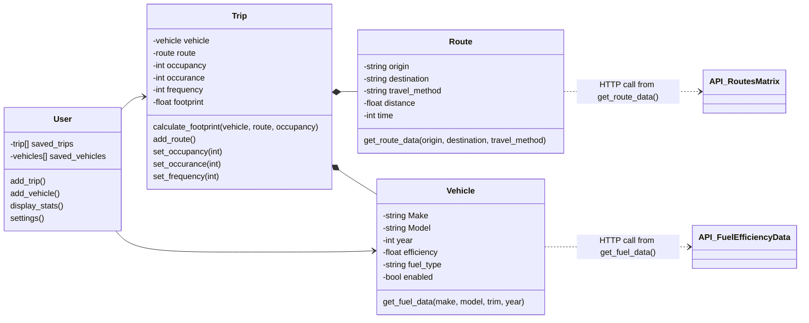

```mermaid
classDiagram
direction LR

    class Trip
        Trip: -vehicle vehicle
        Trip: -route route
        Trip: -int occupancy
        Trip: -int occurance
        Trip: -int frequency
        Trip: -float footprint
        Trip :calculate_footprint(vehicle, route, occupancy)
        Trip :add_route()
        Trip :set_occupancy(int)
        Trip :set_occurance(int)
        Trip :set_frequency(int)

    class Vehicle
        Vehicle: -string Make
        Vehicle: -string Model
        Vehicle: -int year
        Vehicle: -float efficiency
        Vehicle: -string fuel_type
        Vehicle: -bool enabled
        Vehicle :get_fuel_data(make, model, trim, year)

    class Route
        Route: -string origin
        Route: -string destination
        Route: -string travel_method
        Route: -float distance
        Route: -int time
        Route :get_route_data(origin, destination, travel_method)

    class User
        User: -trip[] saved_trips
        User: -vehicles[] saved_vehicles
        User :add_trip()
        User :add_vehicle()
        User :display_stats()
        User :settings()

    
    class API_RoutesMatrix
    class API_FuelEfficiencyData
    

    Trip *-- Route : 
    User --> Trip : 
    Trip *-- Vehicle : 
    User --> Vehicle
    Route ..> API_RoutesMatrix : HTTP call from get_route_data()
    Vehicle ..> API_FuelEfficiencyData : HTTP call from get_fuel_data()


```