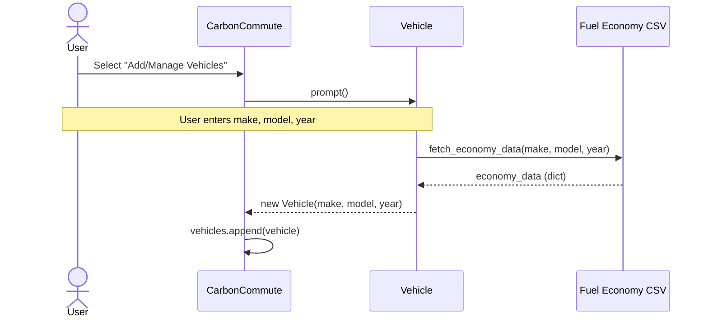
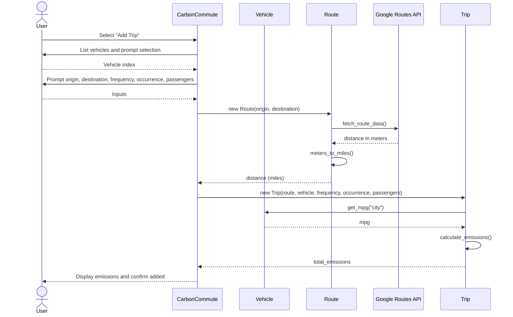
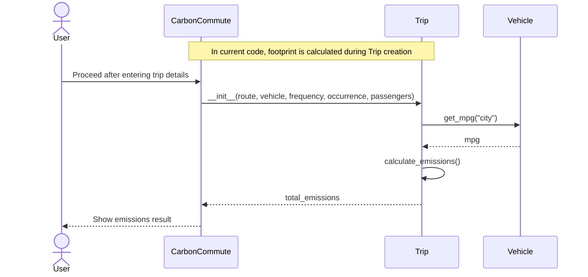
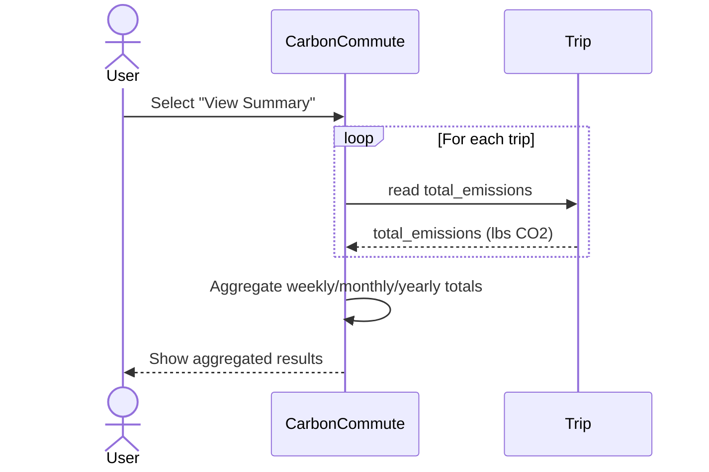
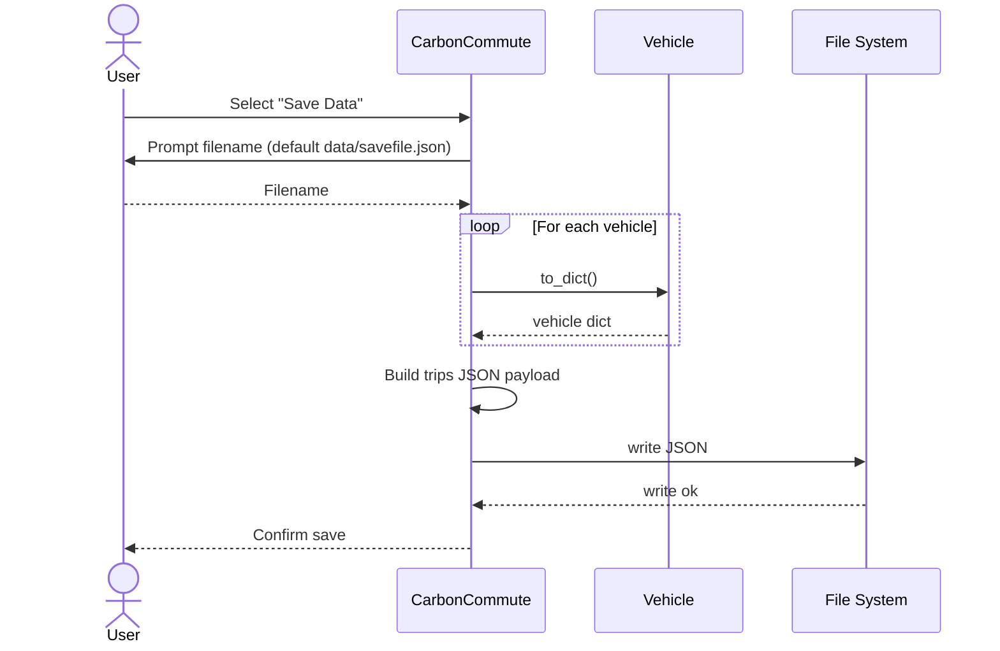
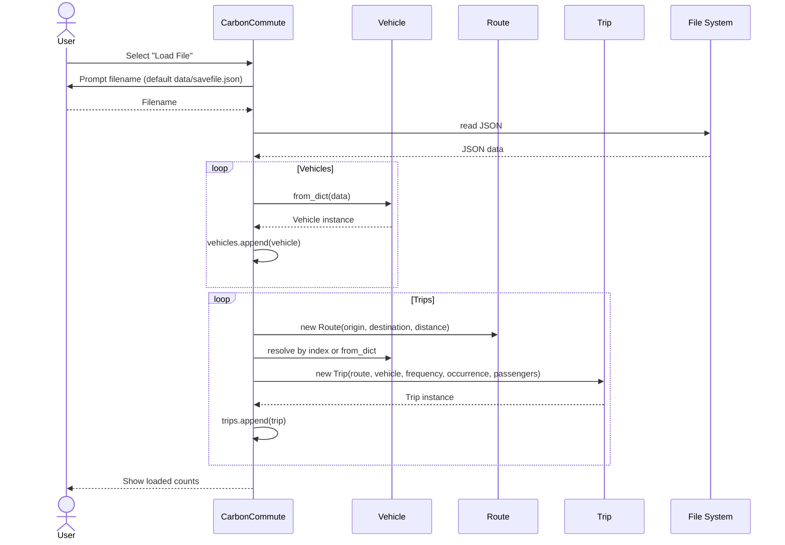

# Use Case Sequence Diagrams

This document provides Mermaid sequence diagrams for the use cases defined in `design/use_case_model.md`. All flows start from `CarbonCommute`.

---

## 1) Add Vehicles

---

## 2) Calculate Trip

---

## 3) Calculate Carbon Footprint

---

## 4) Display Statistics

---

## 5) Save to File

---

## 6) Load from File

