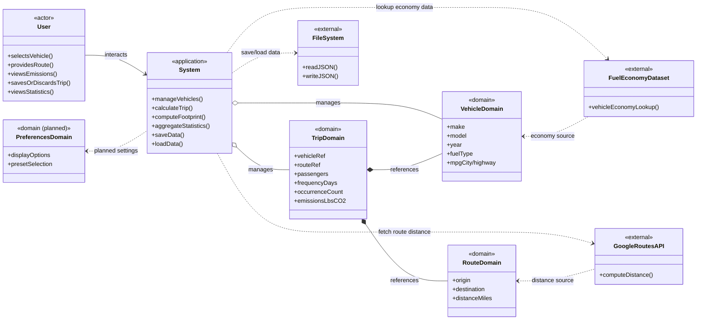

# Domain Model

This diagram represents the primary software domains (concepts) and their relationships/interactions. It focuses on how domains relate, not code classes.

Notes
- Domains abstract the data/behavior of the application, separate from code classes.
- Preferences are planned per `use_case_model.md` but not implemented yet.
- External systems are modeled as separate domains with directional dependencies.
