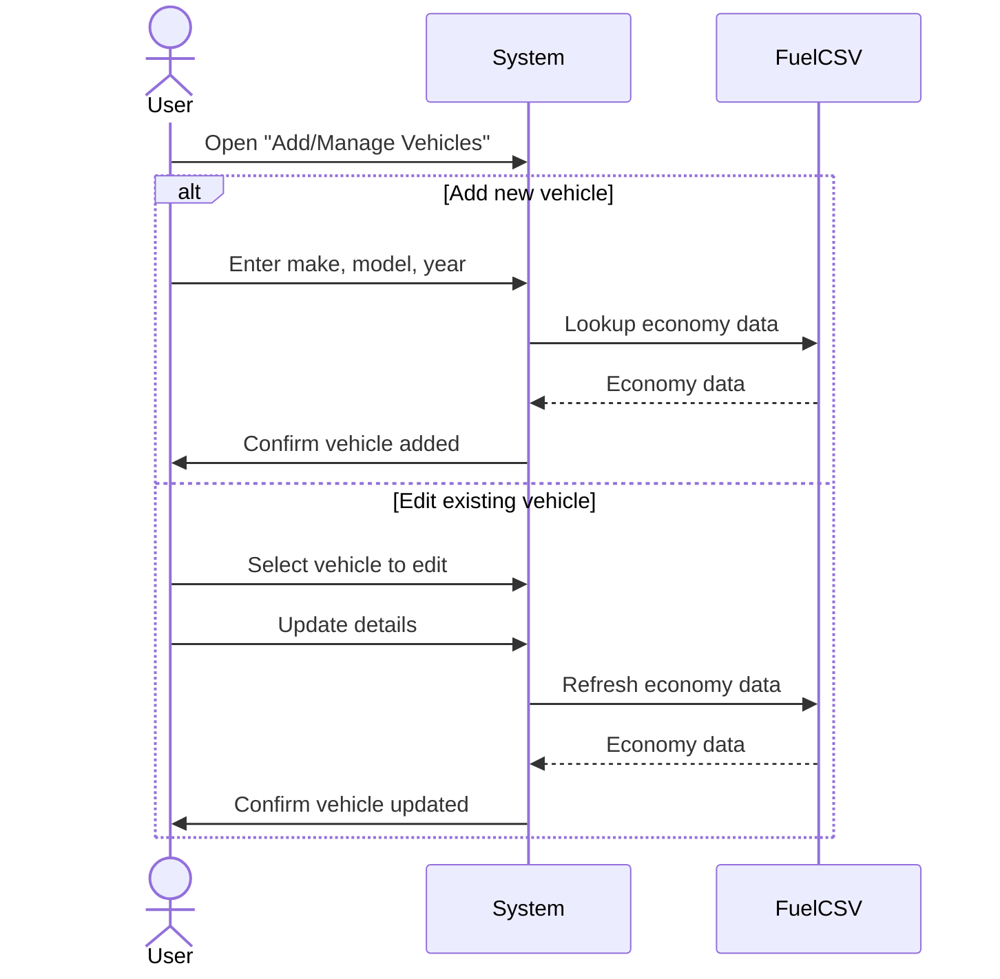
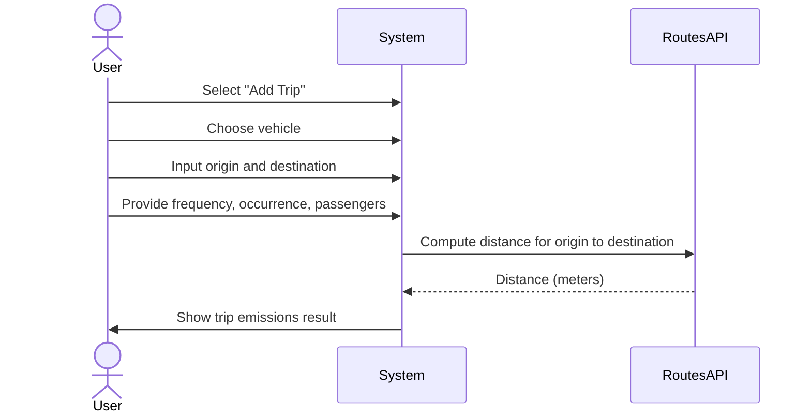
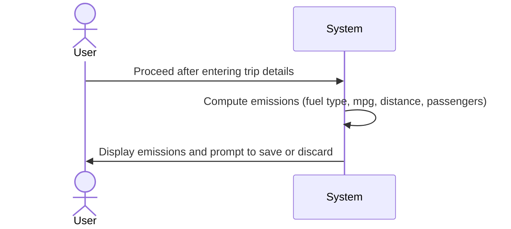
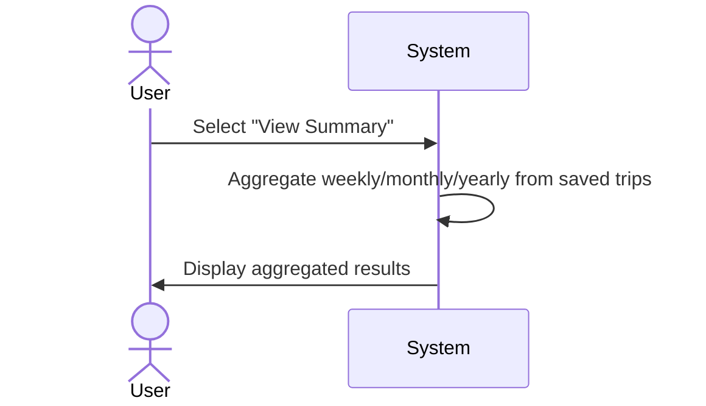
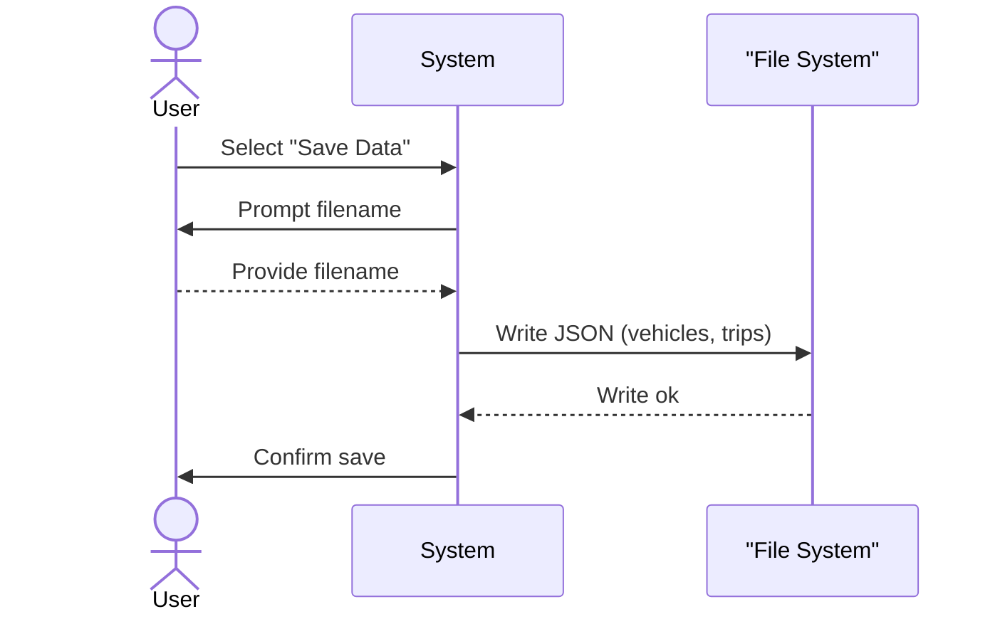
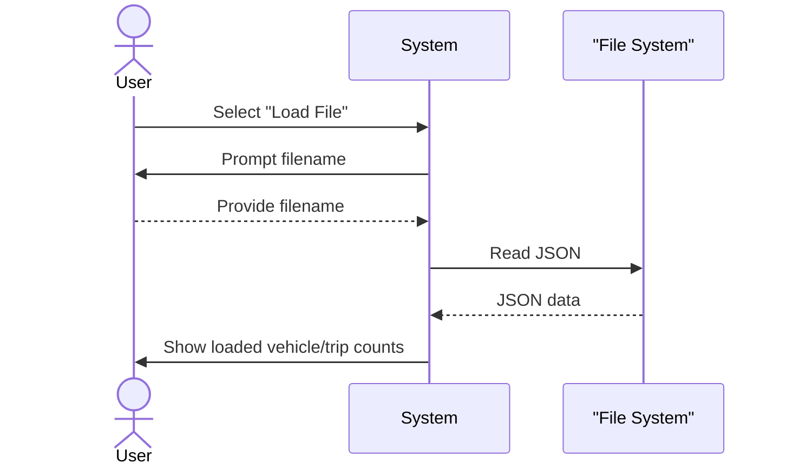

# System Sequence Diagrams (Use Case Coverage)

System-level sequence diagrams for all use cases in `design/use_case_model.md`. These show only interactions between the User, the System (CarbonCommute), and External Systems, aligned with current code.

---

## 1) Add Vehicles

---

## 2) Calculate Trip

---

## 3) Calculate Carbon Footprint

---

## 4) Display Statistics

---

## 5) Save to File

---

## 6) Load from File

